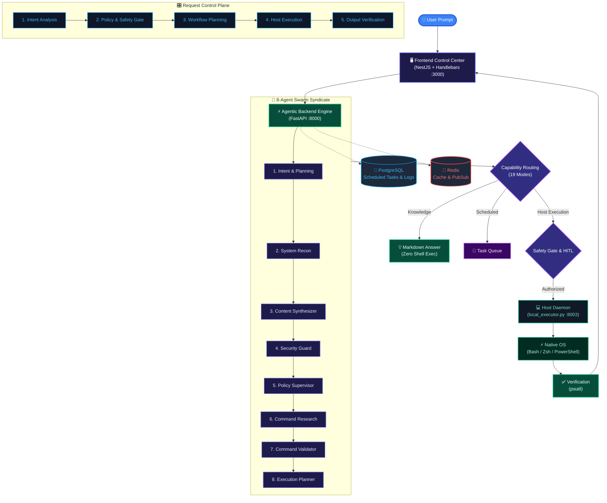
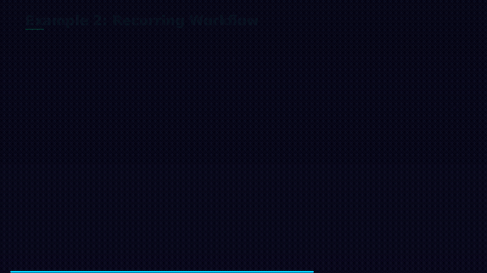

<div align="center">

# 🐚 OmniShell

### Universal Autonomous Multi-Agent OS & Knowledge Syndicate

[](LICENSE)
[](docs/ARCHITECTURE.md)
[](docs/CAPABILITIES_MATRIX.md)
[](docs/ARCHITECTURE.md)
[](docs/SECURITY_AND_GUARDRAILS.md)
[-059669.svg)](tests/test_capabilities.py)
[](CONTRIBUTING.md)
[](CODE_OF_CONDUCT.md)

**Turn natural language into verified, safe system workflows.**
**8 AI agents collaborate to understand your intent, plan execution, and run commands — safely.**

<br/>


<br/>

[🚀 Quick Start](#-quickstart) •
[📖 Documentation](#-complete-documentation) •
[🏗️ Architecture](#️-system-architecture) •
[🤖 Agent Swarm](#-the-8-agent-swarm-syndicate) •
[💡 Examples](#-live-examples) •
[🤝 Contributing](CONTRIBUTING.md)

</div>

---

## 🎬 Demo

<div align="center">

</div>

> **OmniShell** bridges cognitive AI reasoning and physical host execution (Linux, macOS, Windows) through a decentralized **8-Agent Swarm Syndicate**, a strict **5-Stage Request Control Plane**, multi-layer **Human-in-the-Loop (HITL)** safety gates, and persistent **browser-independent background scheduling**.

---

## 🌟 What Sets OmniShell Apart?

| Feature | Traditional Tools | OmniShell |
|---------|:-:|:-:|
| **Natural Language** | ❌ Memorize syntax | ✅ Just describe what you want |
| **Safety** | ❌ Blind execution | ✅ 4-layer defense + HITL gates |
| **Intelligence** | ❌ Single-purpose | ✅ 8 collaborative AI agents |
| **Scheduling** | ❌ Browser-dependent | ✅ Persistent daemon, runs offline |
| **Verification** | ❌ Hope it worked | ✅ Exit code + psutil verification |
| **Recovery** | ❌ Manual debugging | ✅ Self-healing retry chains |

---

## 🏗️ System Architecture

<div align="center">

</div>



---

## 🤖 The 8-Agent Swarm Syndicate

<div align="center">

</div>

Every request flows through a **collaborative syndicate** of 8 specialized AI agents:

| # | Agent | Role | What It Does |
|:-:|-------|------|-------------|
| 1 | **🧠 Intent & Planning** | Classifier | Parses natural language, classifies intent into 19 capability types, determines execution path |
| 2 | **🔍 System Reconnaissance** | Scout | Gathers live host facts — OS type, architecture, available tools, environment context |
| 3 | **📝 Content Synthesizer** | Writer | Generates rich Markdown answers, documentation, research reports for knowledge queries |
| 4 | **🛡️ Security Guard** | Gatekeeper | Enforces AST pattern filtering, blocks dangerous commands (rm -rf, fork bombs, privilege escalation) |
| 5 | **⚖️ Policy Supervisor** | Auditor | Applies organizational policies, detects ambiguity, triggers clarification when needed |
| 6 | **🔬 Command Research** | Researcher | Finds optimal commands with fallback alternatives, handles cross-platform compatibility |
| 7 | **✅ Command Validator** | Checker | Double-validates command safety, checks syntax correctness, verifies flag compatibility |
| 8 | **📋 Execution Planner** | Orchestrator | Sequences multi-step workflows, manages dependencies, plans rollback on failure |

---

## 🏛️ The 19 Core Capabilities

| # | Capability | Type | How It Works |
|:-:|-----------|------|-------------|
| 1 | **💬 Question Answering** | `question_answering` | Contextual Markdown answer cards — zero shell execution |
| 2 | **📋 Information Requests** | `information_request` | Technical dossiers & deep overviews |
| 3 | **🔍 System Inspection** | `system_inspection` | Real-time diagnostic terminal output |
| 4 | **📊 System Analysis** | `analysis` | Performance & bottleneck synthesis |
| 5 | **🖥️ Application Operations** | `application_operation` | Cross-platform app launch |
| 6 | **🌐 Browser Operations** | `browser_operation` | Browser picker & deep-link navigation |
| 7 | **📁 File Operations** | `file_operation` | Safe scripting & file creation |
| 8 | **⚡ Shell Operations** | `shell_operation` | Guarded terminal script execution |
| 9 | **📋 Multi-Step Pipelines** | `multi_step` | Step-by-step visualizer & checklist |
| 10 | **🔄 Interactive Workflows** | `interactive_workflow` | Multi-stage checkpoint wizard |
| 11 | **📅 Scheduled Workflows** | `scheduled_workflow` | PostgreSQL background queue |
| 12 | **🔁 Recurring Workflows** | `recurring_workflow` | Periodic recurrence engine loop |
| 13 | **🔀 Conditional Workflows** | `conditional_workflow` | Dynamic condition branching |
| 14 | **⏰ Desktop Reminders** | `reminder` | Native OS notification alerts |
| 15 | **🔬 Research Tasks** | `research` | Deep synthesis documents |
| 16 | **📝 Planning-Only** | `planning_only` | Phased blueprints (zero shell exec) |
| 17 | **🙋 Human Approval** | `human_approval` | SweetAlert2 double-confirmation |
| 18 | **❓ Clarification** | `clarification` | Actionable clarification buttons |
| 19 | **🛡️ Failure Recovery** | `recovery_failure` | Self-healing retry chain & rollback |

---

## 💡 Live Examples

### Example 1: System Inspection

<div align="center">

</div>

```
You: "Check my system memory and CPU usage"
```

OmniShell automatically:
1. **Classifies** → `system_inspection` (99% confidence)
2. **Safety Gate** → ✅ Verified safe (read-only commands)
3. **Executes** → `free -h`, `top -bn1`, `vmstat 1 3`
4. **Verifies** → Exit codes validated, results formatted

---

### Example 2: Recurring Monitoring

<div align="center">

</div>

```
You: "Monitor disk usage every 30 minutes, alert if above 85%"
```

OmniShell automatically:
1. **Classifies** → `recurring_workflow` (97% confidence)
2. **Schedules** → Cron `*/30 * * * *` stored in PostgreSQL
3. **Runs persistently** → Even after browser is closed
4. **Alerts** → Pop-out approval window when threshold hit

---

### Example 3: Multi-Step Deployment

```
You: "Deploy the latest build to staging"
```

OmniShell automatically:
1. **Plans** 3 sequential steps with rollback strategy
2. **Step 1**: `git pull origin main` → Fetch latest
3. **Step 2**: `npm run build --production` → Build verified
4. **Step 3**: `rsync -avz dist/ staging:/app` → Deploy
5. **Verifies** each step before proceeding to next

---

## 🛠️ Tech Stack

<div align="center">

</div>

| Layer | Technology | Purpose |
|-------|-----------|---------|
| **Backend** | FastAPI (Python) | Async API framework, agent orchestration engine |
| **Frontend** | NestJS + Handlebars | Server-rendered UI with real-time updates |
| **Database** | PostgreSQL 15 | Persistent task scheduling, execution audit logs (JSONB) |
| **Cache** | Redis 7 | Fast-path caching, real-time PubSub |
| **Host Bridge** | local_executor.py | Native OS command execution daemon (:8003) |
| **AI Engine** | LiteLLM | Multi-provider LLM routing |
| **Process Mgmt** | psutil | Exit code & process state verification |
| **Orchestration** | Docker Compose | Container management for all services |

---

## 🚀 Quickstart

### Prerequisites

- Docker & Docker Compose
- Python 3.10+
- Git

### 1. Clone & Configure

```bash
git clone https://github.com/vishwajitvm/OmniShell.git
cd OmniShell/saas_poc
cp .env.template .env
```

### 2. Start the AI Stack

```bash
docker-compose up --build -d
```

This launches:
- 🧠 **Backend** (FastAPI) → `localhost:8000`
- 🖥️ **Frontend** (NestJS) → `localhost:3000`
- 🐘 **PostgreSQL** → `localhost:5432`
- 🔴 **Redis** → `localhost:6379`

### 3. Start Host Executor Daemon

```bash
pip install psutil
python3 local_executor.py
```
> ⚡ The host executor runs on your **native machine** (not in Docker) to execute verified commands.

### 4. Launch Command Center

Open your browser at **[http://localhost:3000](http://localhost:3000)** — you're ready! 🎉

---

## 🛡️ Security Architecture

OmniShell implements a **4-Layer Defense System**:

```
Layer 1: Intent Classification    → Deterministic regex routing (no prompt injection)
Layer 2: Policy & Safety Gate     → AST pattern filtering (blocks rm -rf, fork bombs, etc.)
Layer 3: Human-in-the-Loop (HITL) → Explicit user approval for elevated operations
Layer 4: Process Verification     → psutil exit code + process state validation
```

> 🔒 Every command is inspected, validated, and approved before touching your system. See [Security & Guardrails](docs/SECURITY_AND_GUARDRAILS.md) for full details.

---

## 🧪 Testing

OmniShell includes an extensive automated test suite:

```bash
# Run all tests (40 tests)
python3 -m unittest tests/test_capabilities.py -v

# Run specific test classes
python3 -m unittest tests.test_capabilities.TestCapabilitiesClassification
python3 -m unittest tests.test_capabilities.TestAdversarialAndResilience
```

**Result**: ✅ **40/40 tests passing** (100% success rate)

Tests cover:
- All 19 capability classifications
- Scheduling & recurrence parsing
- Security guardrail validation
- Adversarial input resilience
- Research query typo handling
- Clarification system quality

---

## 📚 Complete Documentation

| Document | Description |
|----------|-------------|
| [🧪 Prompt Test Suite](docs/PROMPT_TEST_SUITE.md) | Copy-pasteable prompts for all 19 capabilities |
| [📐 System Architecture](docs/ARCHITECTURE.md) | Swarm syndicate, control plane, defense layers |
| [📋 Capabilities Matrix](docs/CAPABILITIES_MATRIX.md) | All 19 capabilities with examples |
| [📅 Scheduling Spec](docs/SCHEDULED_PROMPT_EXECUTION.md) | Background scheduling, tokens, approval windows |
| [🔒 Security & Guardrails](docs/SECURITY_AND_GUARDRAILS.md) | 4-layer defense, AST checks, SHA-256 tokens |
| [🔌 API Reference](docs/API_REFERENCE.md) | REST API docs for backend & host executor |
| [🛠️ Troubleshooting](docs/TROUBLESHOOTING_GUIDE.md) | Diagnostic & remediation runbook |
| [💻 Local Setup](docs/LOCAL_SETUP.md) | Installation for Linux, macOS, Windows |
| [🧱 Tech Stack](docs/TECH_STACK.md) | NestJS, FastAPI, PostgreSQL, Redis, LiteLLM |
| [☁️ Deployment](docs/DEPLOYMENT.md) | Cloud deployment & reverse proxy setup |
| [🎤 Interview Pitch](docs/INTERVIEW_PITCH.md) | Elevator pitch & engineering FAQ |

---

## 🗺️ Roadmap

- [ ] **Plugin System** — Extensible agent capabilities via plugins
- [ ] **Multi-OS Executor** — Windows PowerShell & macOS native support
- [ ] **Web Dashboard** — Analytics & pipeline monitoring
- [ ] **Voice Interface** — Speak commands naturally
- [ ] **Team Collaboration** — Shared workflows & approval chains
- [ ] **Custom Agents** — User-defined agent types
- [ ] **API Integrations** — Slack, Discord, Telegram notifications

---

## 🤝 Contributing

Contributions are welcome! Whether it's fixing a bug, adding a feature, or improving docs — every bit helps.

Please read the [Contributing Guide](CONTRIBUTING.md) and [Code of Conduct](CODE_OF_CONDUCT.md) before getting started.

```bash
# Fork → Branch → Commit → PR
git checkout -b feature/your-feature
git commit -m 'Add your feature'
git push origin feature/your-feature
```

---

## 📜 License

This project is licensed under the **MIT License** — see the [LICENSE](LICENSE) file for details.

---

## 🔐 Security

For security vulnerabilities, please see our [Security Policy](SECURITY.md). Do not open public issues for security concerns.

---

## 👤 Author

<div align="center">

**Developed with ❤️ by [Vishwajit VM](https://github.com/vishwajitvm)**

[](https://github.com/vishwajitvm)
[](https://github.com/vishwajitvm/OmniShell)

</div>

---

## ⭐ Star History

If you find OmniShell useful, please consider giving it a ⭐ — it helps others discover the project!

---

<div align="center">

**[🚀 Get Started](https://github.com/vishwajitvm/OmniShell)** •
**[📖 Docs](docs/)** •
**[🐛 Report Bug](https://github.com/vishwajitvm/OmniShell/issues)** •
**[💡 Request Feature](https://github.com/vishwajitvm/OmniShell/issues)**

<sub>Built by Vishwajit VM · MIT License · © 2024-2026</sub>

</div>
