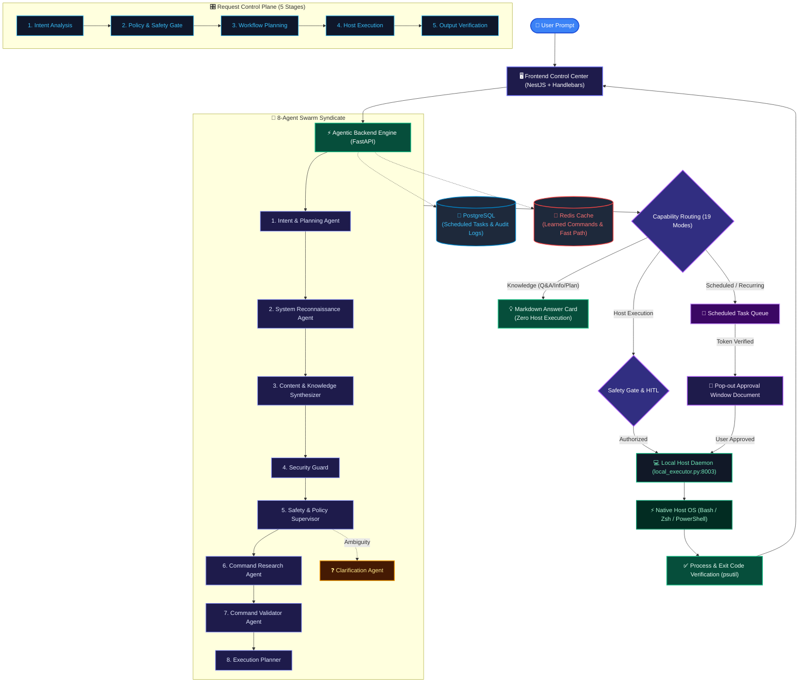

# 🐚 OmniShell - Universal Autonomous Multi-Agent OS & Knowledge Syndicate

[](docs/ARCHITECTURE.md)
[](docs/CAPABILITIES_MATRIX.md)
[](docs/ARCHITECTURE.md)
[](docs/ARCHITECTURE.md)
[-059669.svg)](tests/test_capabilities.py)

**OmniShell** is a universal autonomous multi-agent operating system copilot and knowledge syndicate. It bridges cognitive AI reasoning and physical host execution (Linux, macOS, Windows) through a decentralized **8-Agent Swarm Syndicate**, a strict **5-Stage Request Control Plane**, multi-layer **Human-in-the-Loop (HITL)** safety gates, and persistent **browser-independent background scheduling**.

---

## 🌟 What Sets OmniShell Apart?

- **Trapped in a Chatbox vs. Real OS Automation**: Unlike standard chatbots that only generate instructions, OmniShell translates natural language into verified host operations, deep-linked browser workflows, and background pipelines.
- **Blind Execution vs. Guarded Control Plane**: Unlike naive autonomous agents that execute commands blindly in background subshells, OmniShell enforces strict policy checks, AST pattern filtering, process verification via `psutil`, and explicit user confirmation.
- **Direct Knowledge Isolation**: Factual Q&A, research, and planning queries are automatically delivered as rich Markdown cards with **zero shell invocation**.
- **Browser-Independent Scheduling**: Close your browser or VS Code—the native **Host Executor Daemon (`local_executor.py`)** remains active, automatically opening a dedicated **Pop-out Approval Window Document** when scheduled tasks mature.

---

## 🏗️ System Architecture & Workflow Flowchart



---

## 🏛️ The 19 Core Capabilities Matrix

| Mode | Capability | Type | Output / Execution |
|---|---|---|---|
| **1** | **Question Answering** | `question_answering` | Contextual Markdown Answer Card |
| **2** | **Information Requests** | `information_request` | Technical Dossiers & Overviews |
| **3** | **System Inspection** | `system_inspection` | Real-time Diagnostic Terminal Box |
| **4** | **System Analysis** | `analysis` | Performance & Bottleneck Synthesis |
| **5** | **Application Operations** | `application_operation` | Cross-Platform Application Launch |
| **6** | **Browser Operations** | `browser_operation` | Browser Picker & Deep-Link Navigation |
| **7** | **File Operations** | `file_operation` | Safe Scripting & File Creation |
| **8** | **Shell Operations** | `shell_operation` | Guarded Terminal Script Execution |
| **9** | **Multi-Step Pipelines** | `multi_step` | Step-by-Step Visualizer & Checklist |
| **10** | **Interactive Workflows** | `interactive_workflow` | Multi-Stage Checkpoint Wizard |
| **11** | **Scheduled Workflows** | `scheduled_workflow` | PostgreSQL Background Queue |
| **12** | **Recurring Workflows** | `recurring_workflow` | Periodic Recurrence Engine Loop |
| **13** | **Conditional Workflows** | `conditional_workflow` | Dynamic Condition Branching |
| **14** | **Desktop Reminders** | `reminder` | Native OS Notification Alerts |
| **15** | **Research Tasks** | `research` | Deep Synthesis Document |
| **16** | **Planning-Only Roadmaps** | `planning_only` | Phased Blueprints (Zero Shell Exec) |
| **17** | **Elevated Human Approval** | `human_approval` | In-UI SweetAlert2 Double-Confirmation |
| **18** | **Clarification Requests** | `clarification` | Actionable Clarification Buttons |
| **19** | **Failure Recovery** | `recovery_failure` | Self-Healing Retry Chain & Rollback |

---

## 🚀 Quickstart Guide

### 1. Clone & Configure
```bash
git clone https://github.com/vishwajitvm/OmniShell.git
cd OmniShell/saas_poc
cp .env.template .env
```

### 2. Start Dockerized AI Stack (Backend, Database, Redis, UI)
```bash
docker-compose up --build -d
```

### 3. Start Host Executor Daemon (Native Host Machine)
Open a new terminal window natively on your physical OS and run:
```bash
pip install psutil
python3 local_executor.py
```

### 4. Launch Command Center
Open your browser at [http://localhost:3000](http://localhost:3000).

---

## 📚 Complete Technical Documentation

- **[🧪 Prompt Testing Playbook (Click-to-Copy)](docs/PROMPT_TEST_SUITE.md)**: Official test suite with copy-pasteable prompts across all 19 capabilities.
- **[Project Overview](docs/PROJECT_OVERVIEW.md)**: High-level vision, problem statement, and topology.
- **[System Architecture](docs/ARCHITECTURE.md)**: Swarm syndicate, Request Control Plane, 4-layer defense, and host API.
- **[Capabilities Matrix](docs/CAPABILITIES_MATRIX.md)**: Detailed specification of all 19 capabilities with examples.
- **[Scheduled Execution Specification](docs/SCHEDULED_PROMPT_EXECUTION.md)**: Independent scheduling, tokens, and pop-out window documents.
- **[Security & Guardrails Architecture](docs/SECURITY_AND_GUARDRAILS.md)**: 4-layer defense, AST checks, SHA-256 tokens, and privilege boundaries.
- **[API Reference Specification](docs/API_REFERENCE.md)**: Complete REST API documentation for Backend and Host Executor daemon.
- **[Troubleshooting & Operational Runbook](docs/TROUBLESHOOTING_GUIDE.md)**: Diagnostic and remediation steps for local, docker, and network issues.
- **[Local Setup Guide](docs/LOCAL_SETUP.md)**: Step-by-step installation for Linux, macOS, and Windows.
- **[Tech Stack Breakdown](docs/TECH_STACK.md)**: NestJS, FastAPI, PostgreSQL, Redis, LiteLLM, and psutil.
- **[Deployment Guide](docs/DEPLOYMENT.md)**: Cloud deployment topologies and reverse proxy setup.
- **[Interview & Architecture Pitch Guide](docs/INTERVIEW_PITCH.md)**: Executive elevator pitch and engineering FAQ.

---

## 🧪 Automated Test Verification

OmniShell includes an extensive test suite verifying all 19 capabilities, scheduling calculations, and security guardrails:

```bash
python3 -m unittest tests/test_capabilities.py
```
**Result**: 32/32 tests passing (100% success rate).
