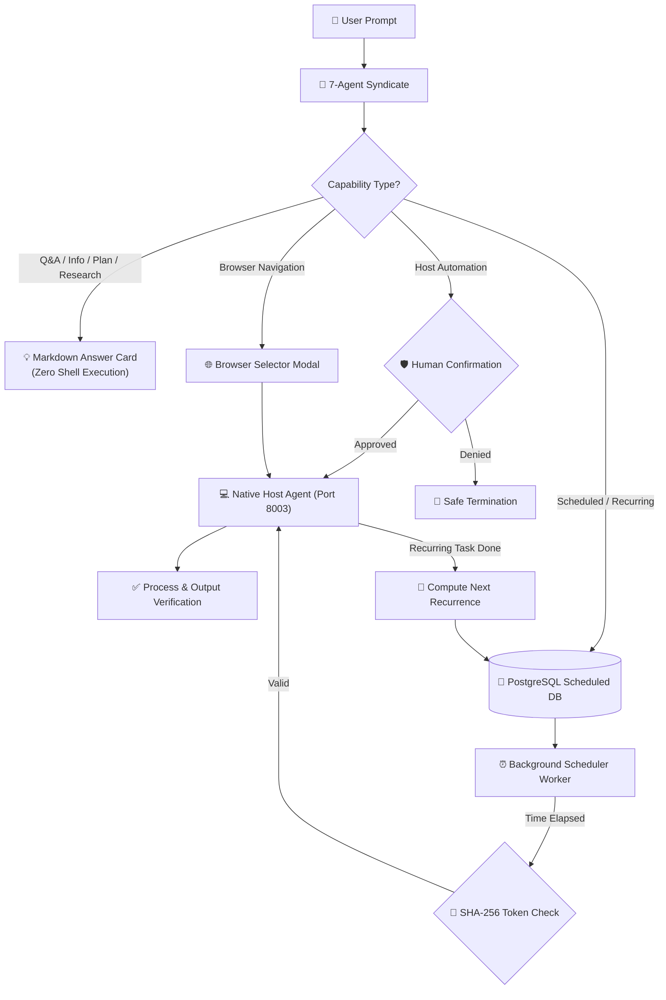

# 🏗️ Architecture Deep Dive

OmniShell is a universal, autonomous multi-agent operating system copilot and knowledge syndicate designed with a strict separation of concerns, multi-layered security guardrails, background scheduling, and self-healing automation.

---

## 🏛️ The 19 Core Capabilities

OmniShell natively supports 19 core interaction paradigms within a single unified pipeline:

1. **Questions and Answers (`question_answering`):** Direct contextual factual and conceptual answers formatted in rich Markdown with syntax highlighting.
2. **Information Requests (`information_request`):** System documentation, technical overviews, and structured summaries.
3. **System Inspection (`system_inspection`):** Real-time diagnostic inspection of CPU, memory, disk, network, processes, and host stats.
4. **Analysis (`analysis`):** In-depth diagnostic log analysis, performance bottleneck detection, and security audit reports.
5. **Application Operations (`application_operation`):** Cross-platform application launching and process tracking.
6. **Browser Operations (`browser_operation`):** Browser-specific URL navigation with interactive browser selection.
7. **File Operations (`file_operation`):** Safe creation, reading, archiving, and management of local files and directories.
8. **Shell Operations (`shell_operation`):** Secure command execution on Linux, macOS, and Windows with real-time streaming output.
9. **Multi-Step Tasks (`multi_step`):** Structured sequential pipelines with visual step checklists and validation tracking.
10. **Interactive Workflows (`interactive_workflow`):** Guided multi-stage workflows with interactive user inputs and confirmation checkpoints.
11. **Scheduled Workflows (`scheduled_workflow`):** Autonomous future execution at exact timestamps or relative offsets with human-in-the-loop gates.
12. **Recurring Workflows (`recurring_workflow`):** Continuous periodic tasks scheduled with interval or daily recurrence rules.
13. **Conditional Workflows (`conditional_workflow`):** Branching execution paths evaluated dynamically based on system state or script exit codes.
14. **Reminders (`reminder`):** Contextual scheduled alerts and notifications with native OS alerts.
15. **Research Tasks (`research`):** Deep multi-tier research synthesizing web data and dynamically discovering unknown commands.
16. **Planning-Only Requests (`planning_only`):** Architectural blueprints, phased migration plans, and sequence diagrams without execution.
17. **Tasks Requiring Human Approval (`human_approval`):** Elevated and potentially destructive operations protected by strict multi-step human confirmation.
18. **Tasks Requiring Clarification (`clarification`):** Ambiguous or underspecified requests automatically prompting user for clarifying choices.
19. **Recovery After Failure (`recovery_failure`):** Self-healing resilient workflows equipped with automated retries and fallback execution chains.

---

## 🤖 The 7-Agent Syndicate

Within the FastAPI backend, requests are processed by a multi-agent system before any code or answer is generated:
1. **OS Intent & Capability Analyzer:** Classifies natural language prompts into one of the 19 core capabilities and detects the target OS.
2. **Security & Guardrail Agent:** A rigid, active AI firewall that hunts for destructive intents (password theft, wiping data) and forces compliance.
3. **Research & Knowledge Synthesis Agent:** Synthesizes direct answers for non-executable queries and queries DuckDuckGo for missing application commands.
4. **Execution & Workflow Planner:** Maps validated intents to either Markdown answers, deep-link URLs, multi-step execution plans, or shell scripts.
5. **Scheduler & Recurrence Agent:** Parses ISO timestamps, relative deltas (`tomorrow at 5pm`), and interval rules (`interval:10s`, `daily:09:00`).
6. **Human Gatekeeper Agent:** Formulates clear confirmation explanations and interactive options when human intervention is needed.
7. **Host Verification Agent (CRITIC):** Analyzes expected process names, exit codes, and resource metrics post-execution.

---

## 🔄 Dual-Track Execution Architecture

---

## 🛡️ 4-Layer Defense Architecture

To ensure zero catastrophic failures, OmniShell implements a rigid 4-Layer Defense:

1. **Layer 0 (Pre-LLM Guardrail):** A hardcoded Python regex interceptor in the backend that scans the raw user prompt. It immediately blocks passwords, system files, dark web, hacking, and mass deletion *before* the AI even sees it. This cannot be jailbroken.
2. **Layer 1 (AI Security Guard):** The Security Guard Agent in the swarm actively denies malicious intents that slip past Layer 0 (e.g., context-aware semantic threats).
3. **Layer 2 (Frontend Double-Confirmation):** Destructive commands (`rm`, `delete`) require a secondary Human-in-the-Loop (HITL) popup. The AI never runs silently.
4. **Layer 3 (Frontend System Override):** Even if the human approves it, a final client-side safeguard blocks known malicious script patterns (like `rm -rf /` or accessing `/etc/shadow`) and permanently terminates the execution.

---

## 🔌 Host Agent API (`local_executor.py`)

The native host execution agent runs on port 8003 and provides:

- `GET /health` — Health check and uptime.
- `GET /capabilities` — List of 19 supported execution modes.
- `GET /system/metrics` — Real-time CPU, RAM, disk, network, and uptime metrics.
- `GET /browsers` — Auto-detected installed browsers on Windows, Linux, and macOS.
- `POST /execute` — Guarded command execution with expected process verification.
- `POST /execute/multi-step` — Sequential execution of structured sub-steps.
- `POST /execute/conditional` — Dynamic condition evaluation with branch dispatch.
- `POST /notify` — Cross-platform desktop notification dispatcher.

