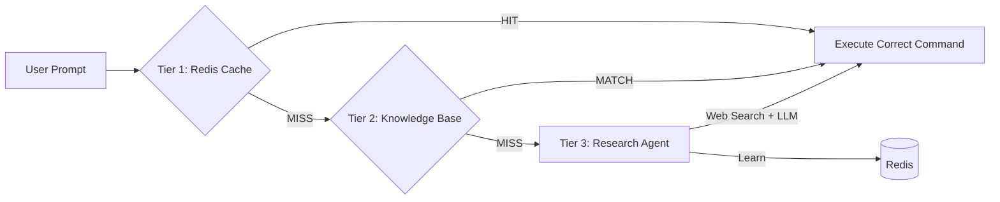
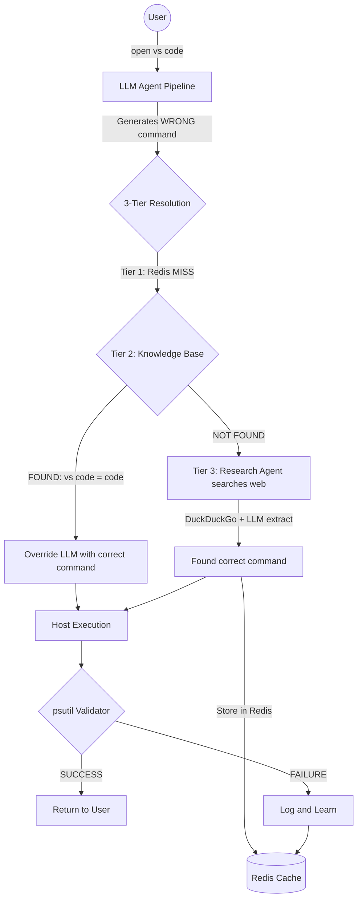

# 🏗️ Architecture Deep Dive

OmniShell relies on a strict separation of concerns to maintain security while executing AI-generated commands.

## The 7-Agent Syndicate
Within the FastAPI backend, requests are processed by a multi-agent system before any code is generated:
1. **Intent & Planning Agent:** Parses natural language into a logical sequence of actions.
2. **System Reconnaissance Agent:** Dynamically writes scripts to discover available applications locally (e.g. searching for text editors) to prevent hallucinating hardcoded paths on different OS builds.
3. **Content Generation Agent:** Expands rough instructions for emails/messages into fully professional text.
4. **Security Guard Agent:** A rigid, active AI firewall that hunts for destructive intents (password theft, wiping data) and forces compliance.
5. **Command Research Agent:** Searches for the exact CLI command for the specific target OS.
6. **Command Validator Agent (CRITIC):** A ruthless reviewer that scrutinizes the Command Research Agent's output. Enforces strict case-sensitivity for Linux, checks for robust fallbacks (e.g., using `find`), and forces a complete rewrite if the initial draft is flawed.
7. **Execution Planner:** Maps the finalized, validated intent to either a `requires_browser=True` Deep Link URL, a robust `shell_script` for local OS execution, or a scheduled reminder.

## 3-Tier Command Resolution

Before executing any command, OmniShell runs a **3-tier resolution pipeline** to ensure the correct command is used:



| Tier | Source | Speed | Description |
|------|--------|-------|-------------|
| **1** | Redis Cache | ⚡ < 1ms | Previously learned commands. Checked first for instant lookups. |
| **2** | `KNOWN_APP_COMMANDS` | ⚡ < 1ms | Hardcoded knowledge base of 20+ common apps and their correct commands. |
| **3** | Research Agent | 🔍 3-10s | DuckDuckGo web search → LLM extraction → stores result in Redis for future. |

## 🛡️ 4-Layer Defense Architecture

To ensure zero catastrophic failures, OmniShell implements a rigid 4-Layer Defense:

1. **Layer 0 (Pre-LLM Guardrail):** A hardcoded Python regex interceptor in the backend that scans the raw user prompt. It immediately blocks passwords, system files, dark web, hacking, and mass deletion *before* the AI even sees it. This cannot be jailbroken.
2. **Layer 1 (AI Security Guard):** The Security Guard Agent in the swarm actively denies malicious intents that slip past Layer 0 (e.g., context-aware semantic threats).
3. **Layer 2 (Frontend Double-Confirmation):** Destructive commands (`rm`, `delete`) require a secondary Human-in-the-Loop (HITL) popup. The AI never runs silently.
4. **Layer 3 (Frontend System Override):** Even if the human approves it, a final client-side safeguard blocks known malicious script patterns (like `rm -rf /` or accessing `/etc/shadow`) and permanently terminates the execution.

## Docker-to-Host Bridging (V2 Executor)
Because the FastAPI backend lives inside an isolated Docker network, it cannot natively launch applications on the host Windows/Linux machine. 

To solve this, OmniShell uses an asynchronous bridge:
1. The AI generates the script/URL.
2. The UI intercepts it and triggers a **SweetAlert2** popup for human approval.
3. Upon approval, the UI sends an HTTP POST request to `http://localhost:8003`.
4. `local_executor.py` (V2) intercepts this on the host machine.
5. The V2 Executor securely uses Python's `subprocess.Popen` pipeline to execute the script in the background, capturing stdout/stderr, applying exact timeouts, and managing the process tree safely without relying on fragile terminal popups.

## 🧠 Self-Learning Pipeline

OmniShell includes a self-correcting learning system that ensures the AI gets smarter with every interaction. Instead of blindly trusting LLM-generated commands, the system validates outputs and learns from mistakes.

### How It Works



### The Three Execution Paths

| Path | Trigger | Behavior |
|------|---------|----------|
| **Known App (Cached)** | App exists in Redis or `KNOWN_APP_COMMANDS` | LLM output is **overridden** with the known-correct command. Near-instant response. |
| **Unknown App (Research)** | App is NOT in knowledge base or cache | **Research Agent** searches the web, extracts the correct command, stores it in Redis, and executes. Next time it's instant. |
| **Failed Execution** | psutil validation fails | The failure is logged with full context (command, expected process, error output, timestamp). Flagged for manual review. |

### Knowledge Base: `KNOWN_APP_COMMANDS`

A curated dictionary of common application mappings that acts as a **middleware override layer** between the LLM and execution:

```python
KNOWN_APP_COMMANDS = {
    "Windows": {
        "vs code":   {"script": "code",     "process": "Code.exe"},
        "calculator": {"script": "calc",    "process": "Calculator.exe"},
        # ...
    },
    "Linux": {
        "vs code":   {"script": "code",     "process": "code"},
        "calculator": {"script": "gnome-calculator", "process": "gnome-calculator"},
        # ...
    }
}
```

### Dual-Store Caching Strategy

- **Redis** — Fast in-memory cache for corrected command mappings. Enables sub-millisecond lookups for repeat requests, allowing the system to bypass the LLM entirely for known apps.
- **PostgreSQL** — Persistent store for the complete correction history including timestamps, original LLM output, corrected command, validation results, and error logs. Used for analytics, debugging, and model fine-tuning.

> See the full diagrams at:
> - [`architecture.mmd`](./diagrams/architecture.mmd) — 5-Agent architecture with 3-Tier resolution
> - [`self_learning_pipeline.mmd`](./diagrams/self_learning_pipeline.mmd) — Detailed pipeline with known/unknown/cached paths
> - [`learning_fix_flow.mmd`](./diagrams/learning_fix_flow.mmd) — Complete learning & self-correction flow
