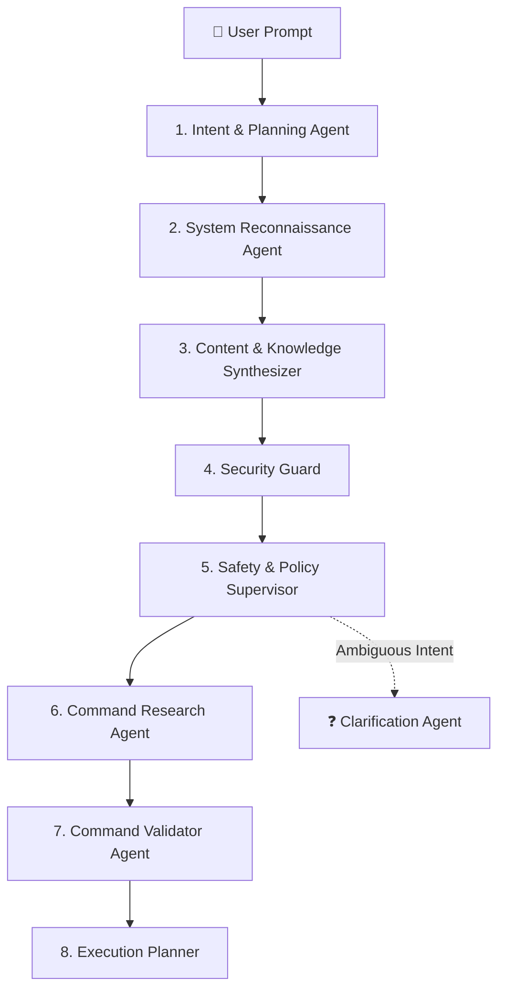
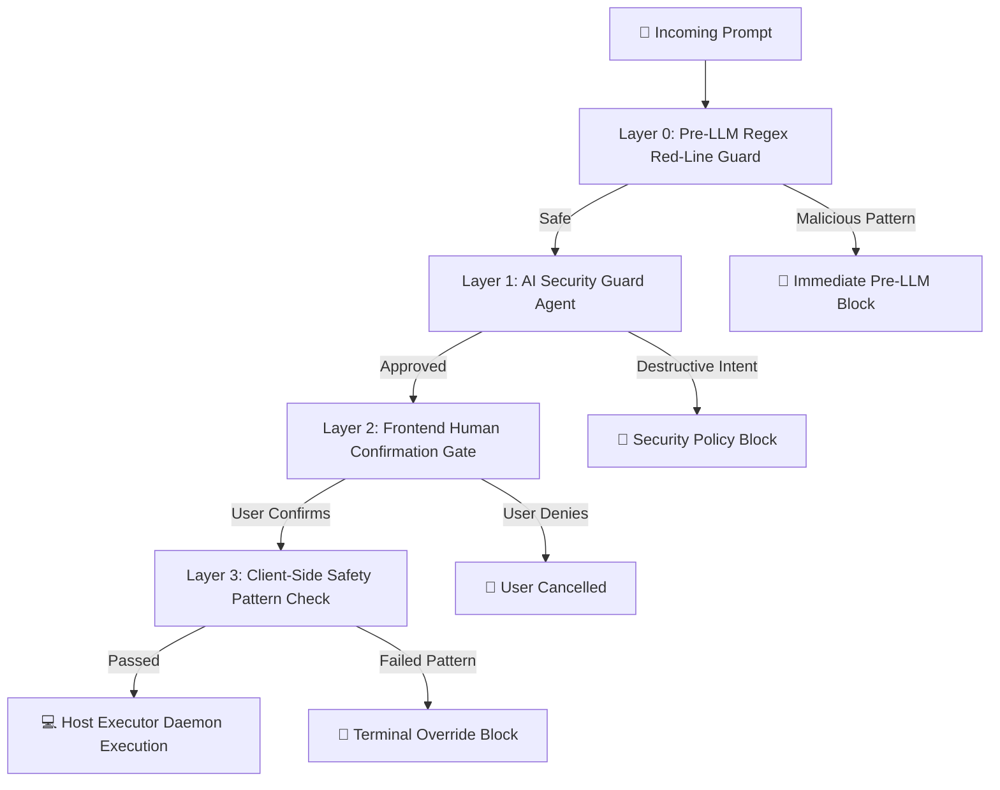

# 🏗️ OmniShell Architecture Deep Dive

OmniShell is architected as an autonomous, multi-agent operating system copilot and knowledge syndicate designed with a strict separation of concerns, multi-layered security guardrails, background scheduling, and self-healing automation.

---

## 🏛️ The 19 Core Capabilities Matrix

OmniShell natively supports 19 core interaction paradigms within a single unified pipeline:

| # | Capability Name | Identifier | Execution Required | Primary Output Mode |
|---|---|---|---|---|
| **1** | **Question Answering** | `question_answering` | ❌ No | Markdown Direct Answer Card |
| **2** | **Information Requests** | `information_request` | ❌ No | Structured Technical Dossier |
| **3** | **System Inspection** | `system_inspection` | ✅ Yes | Real-time Diagnostic Terminal Box |
| **4** | **System Analysis** | `analysis` | ❌/✅ Optional | Diagnostic Synthesis & Bottleneck Report |
| **5** | **Application Operations** | `application_operation` | ✅ Yes | Native Process Spawning |
| **6** | **Browser Operations** | `browser_operation` | ✅ Yes | Browser Picker & Deep-Link Navigation |
| **7** | **File Operations** | `file_operation` | ✅ Yes | Native File Creation / Script Execution |
| **8** | **Shell Operations** | `shell_operation` | ✅ Yes | Native Shell Terminal Execution |
| **9** | **Multi-Step Pipelines** | `multi_step` | ✅ Yes | Sequential Step Visualizer & Checklist |
| **10** | **Interactive Workflows** | `interactive_workflow` | ✅ Yes | Multi-Stage Interactive Checkpoints |
| **11** | **Scheduled Workflows** | `scheduled_workflow` | ✅ Yes | PostgreSQL Scheduled Task Queue |
| **12** | **Recurring Workflows** | `recurring_workflow` | ✅ Yes | Continuous Periodic Recurrence Loop |
| **13** | **Conditional Workflows** | `conditional_workflow` | ✅ Yes | Dynamic Condition Evaluation & Branching |
| **14** | **Desktop Reminders** | `reminder` | ✅ Yes | Native Desktop Notification Dispatch |
| **15** | **Research Tasks** | `research` | ❌ No | Multi-Source Web & System Synthesis |
| **16** | **Planning-Only Requests** | `planning_only` | ❌ No | Architectural Roadmap (Zero Shell Exec) |
| **17** | **Elevated Human Approval** | `human_approval` | ✅ Yes | In-UI SweetAlert2 Double-Confirmation |
| **18** | **Clarification Requests** | `clarification` | ❌ No | Actionable Option Buttons |
| **19** | **Failure Recovery** | `recovery_failure` | ✅ Yes | Self-Healing Retry Chain & Rollback |

---

## 🤖 The 8-Agent Swarm Syndicate

Every user prompt submitted to the backend is evaluated by a collaborative swarm of specialized agents:

### Agent Roles & Deliverables:
1. **Intent & Planning Agent**: Deconstructs raw natural language into structured operational steps, identifying target parameters and the primary capability category (confidence score: 0–100%).
2. **System Reconnaissance Agent**: Identifies the host environment (Linux, macOS, Windows), inspects binary paths (`/bin/bash`, `which`, `where`), and maps required environment variables.
3. **Content & Knowledge Synthesizer**: Synthesizes rich, structured Markdown answers for factual queries and drafts contextual email bodies or documentation notes.
4. **Security Guard**: Evaluates the prompt against prohibited Abstract Syntax Tree (AST) patterns, mass deletion risks, and malicious payloads.
5. **Safety & Policy Supervisor**: Enforces execution boundaries and assigns risk levels (`LOW`, `MEDIUM`, `HIGH`, `BLOCKED`).
6. **Command Research Agent**: Queries the local knowledge base and autonomous web search (DuckDuckGo) to discover appropriate command syntax for unknown applications.
7. **Command Validator Agent**: Validates shell quoting, environment compatibility, process termination criteria, and expected exit codes.
8. **Execution Planner**: Finalizes the routing path, constructing either a direct Markdown card, a browser deep-link, a multi-step plan, or a persistent host execution payload.
9. **Clarification & Disambiguation Agent**: Triggered when a prompt is underspecified or ambiguous, generating structured interactive choice buttons for user clarification.

---

## 🎛️ The Request Control Plane Lifecycle

OmniShell implements a formal Request Control Plane tracking 5 continuous stages:

$$\text{Intent} \longrightarrow \text{Policy} \longrightarrow \text{Plan} \longrightarrow \text{Execute} \longrightarrow \text{Verify}$$

1. **Stage 1: Intent Analysis**: Maps prompt signals to capability and confidence score.
2. **Stage 2: Policy & Safety Gate**: Validates the command against safety rules and determines if human authorization is required.
3. **Stage 3: Workflow Planning**: Constructs the executable payload or direct answer with the 8-agent swarm.
4. **Stage 4: Host Execution**: Dispatches commands to the local daemon, opens browsers, or enrolls in the database queue.
5. **Stage 5: Output Verification**: Inspects exit codes (`$? == 0`), process hierarchies via `psutil`, and captures telemetry timings.

---

## 🛡️ 4-Layer Defense Architecture

OmniShell protects the host machine through four concentric layers of security:

1. **Layer 0 (Pre-LLM Regex Guard)**: Hardcoded deterministic filter in Python (`re.search`) that blocks mass deletion (`rm -rf /`, `mkfs`), credential dumping (`/etc/shadow`, `SAM`), and crypto-miners before the AI engine is invoked.
2. **Layer 1 (AI Security Guard Agent)**: Cognitive agent evaluating semantic risk, privilege escalation, and downgrading sensitive intents (e.g., forcing auto-send to draft).
3. **Layer 2 (Frontend Human Gate)**: Interactive SweetAlert2 dialogs and standalone Pop-out Approval Windows requiring explicit user confirmation before host mutation.
4. **Layer 3 (Client-Side Terminal Override)**: Final regex screening in the browser client prior to dispatching HTTP payloads to port 8003.

---

## 🔒 Dual Approval Architecture

OmniShell provides specialized approval flows tailored for user context:

### 1. In-UI SweetAlert2 Confirmation Modal (Immediate Operations)
- **Use Case**: Real-time elevated shell operations, file cleanups, and trash purges.
- **Workflow**: Renders an interactive modal displaying the exact script payload, warning labels, and "Authorize & Execute" / "Cancel" buttons directly in the active session.

### 2. Pop-out Approval Window Document (Scheduled & Background Operations)
- **Use Case**: Scheduled tasks (`scheduled_workflow`) and recurring cron jobs (`recurring_workflow`) where the original browser tab may be closed or inactive.
- **Workflow**: When the task timestamp matures, the Host Executor Daemon automatically launches a standalone window pointing to `http://localhost:3000/scheduled-approval/<token>?taskId=<id>`.
- **Security**: Validates single-use URL-safe SHA-256 tokens and enforces a 300-second countdown timeout before automatic expiration.

---

## 💻 Host Daemon Specification (`local_executor.py` on Port 8003)

The Host Executor Daemon is a Python service running natively on the host machine:

| Endpoint | Method | Description |
|---|---|---|
| `/health` | `GET` | Reports daemon uptime, platform OS, and status |
| `/capabilities` | `GET` | Returns list of 19 supported execution modes |
| `/system/metrics` | `GET` | Real-time CPU, RAM, disk, network, and system uptime |
| `/browsers` | `GET` | Returns auto-detected installed web browsers |
| `/execute` | `POST` | Executes shell commands with process and exit code validation |
| `/execute/multi-step` | `POST` | Executes structured sequential sub-steps with status tracking |
| `/execute/conditional` | `POST` | Evaluates system conditions and dispatches conditional branches |
| `/notify` | `POST` | Dispatches native cross-platform OS notifications |
