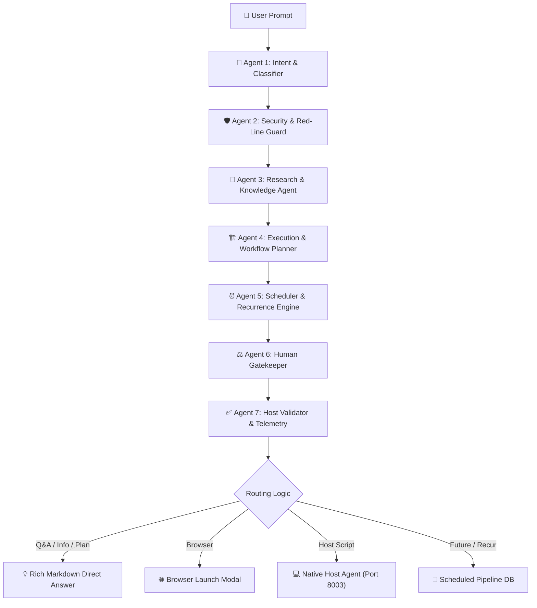

# OmniShell 19 Core Capabilities Matrix & Specification

OmniShell is a universal, autonomous multi-agent operating system copilot and knowledge syndicate capable of contextual understanding, guarded host execution, persistent background scheduling, recurring automation, and rich knowledge synthesis across Windows, macOS, and Linux.

---

## 🏛️ Comprehensive Capabilities Matrix

| # | Capability Name | Identifier | Execution Required | Human Gate | Primary Output | Example Prompt |
|---|---|---|---|---|---|---|
| **1** | **Questions and Answers** | `question_answering` | ❌ No | None | Markdown Direct Answer | *"What is the capital of India?"* |
| **2** | **Information Requests** | `information_request` | ❌ No | None | Structured Technical Summary | *"Tell me about Docker containers and how they work"* |
| **3** | **System Inspection** | `system_inspection` | ✅ Yes | Safe Auto/Approval | Telemetry & Terminal Box | *"Inspect current system memory and CPU utilization"* |
| **4** | **Analysis** | `analysis` | ❌/✅ Optional | Safe Auto | Diagnostic Synthesis Report | *"Analyze system performance and diagnose resource bottlenecks"* |
| **5** | **Application Operations** | `application_operation` | ✅ Yes | Human Confirmation | Host Process Launch | *"Open Visual Studio Code"* |
| **6** | **Browser Operations** | `browser_operation` | ✅ Yes | Browser Picker Modal | Browser Window Navigation | *"Open Google Chrome to https://github.com"* |
| **7** | **File Operations** | `file_operation` | ✅ Yes | Confirmation Gate | Shell Script & File Mod | *"Create a file named notes.txt and list files"* |
| **8** | **Shell Operations** | `shell_operation` | ✅ Yes | Human Confirmation | Terminal Script Execution | *"Run command echo 'Hello OmniShell'"* |
| **9** | **Multi-Step Tasks** | `multi_step` | ✅ Yes | Step-by-Step Tracker | Interactive Step Visualizer | *"Create a multi-step workflow to check disk and backup logs"* |
| **10** | **Interactive Workflows** | `interactive_workflow` | ✅ Yes | Checkpoint Prompts | Multi-Stage Prompts | *"Interactive wizard for environment setup"* |
| **11** | **Scheduled Workflows** | `scheduled_workflow` | ✅ Yes | Time Window + Secret Token | PostgreSQL Scheduled Pipeline | *"Schedule backup script tomorrow at 3pm"* |
| **12** | **Recurring Workflows** | `recurring_workflow` | ✅ Yes | Autonomous Loop | Periodic Execution Loop | *"Check disk free space every 10 seconds and report"* |
| **13** | **Conditional Workflows** | `conditional_workflow` | ✅ Yes | Branching Evaluator | Dynamic Condition Evaluation | *"If memory usage > 90% then trigger cleanup alert"* |
| **14** | **Reminders** | `reminder` | ✅ Yes | Desktop Notification | Native OS Notification | *"Remind me in 15 minutes to drink water"* |
| **15** | **Research Tasks** | `research` | ❌ No | None | Deep Synthesis Document | *"Research latest autonomous agent architectures"* |
| **16** | **Planning-Only Requests** | `planning_only` | ❌ No | None | Architecture Roadmap & Plan | *"Plan the database migration steps without executing anything"* |
| **17** | **Tasks Requiring Human Approval** | `human_approval` | ✅ Yes | Strict Double-Confirmation | Elevated Approval Modal | *"Delete and clean all temporary cache files in /tmp"* |
| **18** | **Tasks Requiring Clarification** | `clarification` | ❌ No | Interactive Options | Clarification Option Buttons | *"Deploy the application to cloud"* |
| **19** | **Recovery After Failure** | `recovery_failure` | ✅ Yes | Rollback Strategy | Self-Healing Retry Chain | *"Restart web service with automatic rollback on error"* |

---

## 🤖 7-Agent Syndicate Architecture

Every user request is processed collaboratively by 7 specialized autonomous agents:



### Agent Roles & Deliverables:
1. **OS Intent & Capability Analyzer**: Classifies the prompt into one of the 19 core capabilities and detects the target OS.
2. **Security & Guardrail Agent**: Applies multi-layer red-line security checks (`rm -rf /`, credential harvesting, ransomware patterns) and determines if human confirmation is required.
3. **Research & Knowledge Synthesis Agent**: Fetches up-to-date documentation or synthesizes direct markdown answers for non-executable knowledge queries.
4. **Execution Planner Agent**: Decomposes complex multi-step tasks into atomic, deterministic commands with verification criteria.
5. **Scheduler & Recurrence Agent**: Parses ISO timestamps, relative deltas (`tomorrow at 5pm`), and interval rules (`interval:10s`, `daily:09:00`).
6. **Human Gatekeeper Agent**: Formulates clear confirmation explanations and interactive options when human intervention is needed.
7. **Host Verification Agent**: Analyzes expected process names, exit codes, and resource metrics post-execution.

---

## 📦 Pydantic Data Model (`MultiAgentResult`)

```python
class MultiAgentResult(BaseModel):
    multi_agent_discussion: list[AgentThought]
    capability_type: str
    direct_answer: str | None
    is_safe: bool | None
    target_os: str | None
    requires_browser: bool | None
    target_url: str | None
    shell_script: str | None
    expected_process: str | None
    mermaid_diagram_body: str | None
    model_used: str | None
    multi_step_plan: list[dict] | None
    requires_interactive: bool | None
    interactive_prompts: list[str] | None
    requires_clarification: bool | None
    clarification_questions: list[str] | None
    is_planning_only: bool | None
    is_scheduled: bool
    scheduled_time: str | None
    is_recurring: bool
    recurrence_rule: str | None
    conditional_logic: dict | None
    recovery_strategy: dict | None
    requires_approval: bool | None
    approval_reason: str | None
    is_reminder: bool
```

---

## 🛡️ Guardrails & Safety Matrix

1. **Pre-LLM Regex Red-Line Filter**:
   - Blocks destructive root modifications (`rm -rf /`, `mkfs`, `wipefs`, `dd if=/dev/zero`).
   - Blocks credential harvesting (`/etc/shadow`, `.ssh/id_rsa`, Windows SAM registry).
   - Blocks cryptocurrency miners (`xmrig`, `coinhive`) and reverse shells.
2. **Strict Human-in-the-Loop Confirmation**:
   - Destructive operations require explicit SweetAlert2 approval with secondary warning dialog.
3. **Approval Token Hash Validation**:
   - Scheduled task approvals use cryptographic tokens (`secrets.token_urlsafe(32)`) hashed with SHA-256 in PostgreSQL.
4. **Non-Executable Query Isolation**:
   - Factual queries (Q&A, analysis, research, planning) intentionally suppress shell execution and present clean Markdown answers.

---

## 🔄 Recurrence & Scheduling Engine

- **Interval Execution**: `interval:<N>s|m|h|d` (e.g. `interval:10s`, `interval:5m`, `interval:2h`, `interval:1d`).
- **Daily Fixed-Time Execution**: `daily:HH:MM` (e.g. `daily:09:00`, `daily:14:30`).
- **Rescheduling Loop**: When a recurring task completes on the host executor, `store_scheduled_task_result` calculates the next UTC timestamp and transitions status back to `scheduled`, enabling zero-polling continuous automation.

---

## 🧪 Verification & Automated Testing

All 19 capabilities, scheduling calculations, guardrails, and host executor endpoints are tested via `saas_poc/tests/test_capabilities.py`:
- **32 unit tests passing (100% success rate)**
- Tested with `python3 -m unittest tests/test_capabilities.py`
