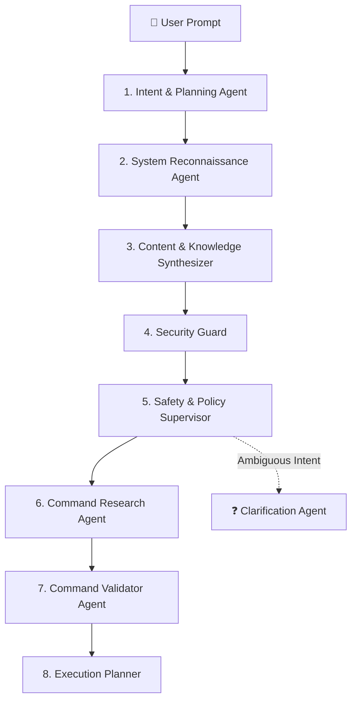

# 🏛️ OmniShell 19 Core Capabilities Matrix & Technical Specification

OmniShell is a universal, autonomous multi-agent operating system copilot and knowledge syndicate capable of contextual understanding, guarded host execution, persistent background scheduling, recurring automation, and rich knowledge synthesis across Linux, macOS, and Windows.

---

## 📊 Detailed Capabilities Matrix

| # | Capability Name | Identifier | Execution Required | Human Gate | Primary Output | Example Prompt |
|---|---|---|---|---|---|---|
| **1** | **Question Answering** | `question_answering` | ❌ No | None | Markdown Direct Answer | *"What is the difference between TCP and UDP?"* |
| **2** | **Information Requests** | `information_request` | ❌ No | None | Structured Technical Dossier | *"Tell me about Docker architecture and containers"* |
| **3** | **System Inspection** | `system_inspection` | ✅ Yes | Safe Auto / Approve | Telemetry & Terminal Box | *"Which Python version is installed on my device?"* |
| **4** | **System Analysis** | `analysis` | ❌/✅ Optional | Safe Auto | Diagnostic Synthesis Report | *"Analyze system performance and diagnose resource bottlenecks"* |
| **5** | **Application Operations** | `application_operation` | ✅ Yes | Human Confirmation | Host Process Launch | *"Open Visual Studio Code in current directory"* |
| **6** | **Browser Operations** | `browser_operation` | ✅ Yes | Browser Picker Modal | Browser Window Navigation | *"Open Gmail on Brave and draft a message"* |
| **7** | **File Operations** | `file_operation` | ✅ Yes | Confirmation Gate | Shell Script & File Mod | *"Create a project directory structure and notes.txt"* |
| **8** | **Shell Operations** | `shell_operation` | ✅ Yes | Human Confirmation | Terminal Script Execution | *"Run command uname -a and check kernel version"* |
| **9** | **Multi-Step Pipelines** | `multi_step` | ✅ Yes | Step-by-Step Tracker | Interactive Step Visualizer | *"Check disk usage, archive old logs, and clean /tmp"* |
| **10** | **Interactive Workflows** | `interactive_workflow` | ✅ Yes | Checkpoint Prompts | Multi-Stage Prompts | *"Guided interactive wizard for development setup"* |
| **11** | **Scheduled Workflows** | `scheduled_workflow` | ✅ Yes | Pop-out Window + Token | PostgreSQL Task Pipeline | *"Run system backup script tomorrow at 3:00 AM"* |
| **12** | **Recurring Workflows** | `recurring_workflow` | ✅ Yes | Autonomous Loop | Periodic Recurrence Engine | *"Check free disk space every 10 seconds and report"* |
| **13** | **Conditional Workflows** | `conditional_workflow` | ✅ Yes | Branching Evaluator | Dynamic Condition Evaluation | *"If memory usage > 90% then alert and free cache"* |
| **14** | **Desktop Reminders** | `reminder` | ✅ Yes | Desktop Notification | Native OS Notification | *"Remind me in 15 minutes to stand up and drink water"* |
| **15** | **Research Tasks** | `research` | ❌ No | None | Deep Synthesis Document | *"Research latest state of multi-agent LLM systems"* |
| **16** | **Planning-Only Roadmaps** | `planning_only` | ❌ No | None | Phased Blueprint (No Exec) | *"Plan database migration steps without executing"* |
| **17** | **Elevated Human Approval** | `human_approval` | ✅ Yes | Strict Double-Confirmation | Elevated Approval Modal | *"Clean my trash and purge temporary cache"* |
| **18** | **Clarification Requests** | `clarification` | ❌ No | Interactive Options | Actionable Option Buttons | *"Deploy my app to the server"* |
| **19** | **Failure Recovery** | `recovery_failure` | ✅ Yes | Rollback Strategy | Self-Healing Retry Chain | *"Restart web server with automated rollback on error"* |

---

## 🤖 Swarm Collaboration Specification

Every prompt is evaluated by the 8-Agent Swarm Syndicate:



### Agent Roles:
1. **Intent & Planning Agent**: Extracts entities, operational intent, and determines primary capability (confidence: 0–100%).
2. **System Reconnaissance Agent**: Inspects host OS (`Linux`, `Darwin`, `Windows`), native shell (`/bin/bash`, `pwsh`), and binary presence.
3. **Content & Knowledge Synthesizer**: Produces formatted Markdown content for non-executable responses and drafts contextual communication.
4. **Security Guard**: Inspects for AST red-lines (`rm -rf /`, credential harvesting, malware signatures).
5. **Safety & Policy Supervisor**: Designates safety gate state (`VERIFIED SAFE`, `APPROVAL REQUIRED`, `BLOCKED`).
6. **Command Research Agent**: Queries DuckDuckGo and local knowledge cache for obscure CLI tools and arguments.
7. **Command Validator Agent**: Validates shell quoting, environment compatibility, and expected exit codes.
8. **Execution Planner**: Synthesizes final JSON payload, flowchart schema, and determines execution routing mode.
9. **Clarification Agent**: Generates structured, clickable option cards when prompts lack specific outcomes or parameters.

---

## 📦 Pydantic Data Model (`MultiAgentResult`)

```python
class MultiAgentResult(BaseModel):
    multi_agent_discussion: list[AgentThought]
    capability_type: str
    direct_answer: str | None
    is_safe: bool | None
    target_os: str | None
    requires_browser: bool | None
    target_url: str | None
    shell_script: str | None
    expected_process: str | None
    mermaid_diagram_body: str | None
    model_used: str | None
    multi_step_plan: list[dict] | None
    requires_interactive: bool | None
    interactive_prompts: list[str] | None
    requires_clarification: bool | None
    clarification_questions: list[str] | None
    is_planning_only: bool | None
    is_scheduled: bool
    scheduled_time: str | None
    is_recurring: bool
    recurrence_rule: str | None
    conditional_logic: dict | None
    recovery_strategy: dict | None
    requires_approval: bool | None
    approval_reason: str | None
    is_reminder: bool
```

---

## 🧪 Automated Verification & Test Coverage

All 19 capabilities, scheduling calculations, guardrails, and host executor endpoints are validated with automated test suites:
- **Location**: `tests/test_capabilities.py`
- **Execution**: `python3 -m unittest tests/test_capabilities.py`
- **Pass Rate**: 32/32 tests passing (100% success rate)
- **Coverage**: Intent classification, regex red-line blocking, scheduled task token lifecycle, and recurrence intervals.
