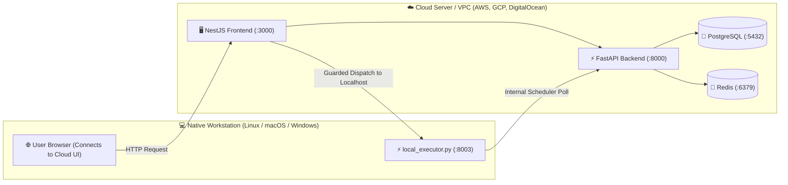

# 🚀 OmniShell Production Deployment Guide

OmniShell's decoupled architecture allows flexible deployment models:
1. **Full Local Deployment**: Running all containers and host executor locally on the same physical machine.
2. **Hybrid Cloud Deployment**: Running the **Brain** (FastAPI backend, PostgreSQL, Redis, and NestJS frontend) on a cloud VM/Kubernetes cluster, while running the **Muscle** (`local_executor.py`) natively on user workstations.

---

## ☁️ Hybrid Cloud Deployment Model



---

## 🛠️ Step-by-Step Server Setup

### 1. Provision Server & Clone Repo
```bash
git clone https://github.com/vishwajitvm/OmniShell.git
cd OmniShell/saas_poc
```

### 2. Configure Production `.env`
Ensure all production secrets, database credentials, and LLM API keys are configured:
```env
LITELLM_MODEL=nvidia/deepseek-ai/deepseek-r1
NVIDIA_NIM_API_KEY=your_production_key
POSTGRES_USER=omnishell_admin
POSTGRES_PASSWORD=strong_production_password
POSTGRES_DB=omnishell_db
REDIS_HOST=redis
REDIS_PORT=6379
```

### 3. Deploy Stack with Docker Compose
```bash
docker-compose up --build -d
```

### 4. Reverse Proxy & SSL (Nginx / Caddy)
Configure Nginx to reverse-proxy port 3000 with HTTPS (Let's Encrypt SSL):

```nginx
server {
    server_name omnishell.yourdomain.com;

    location / {
        proxy_pass http://127.0.0.1:3000;
        proxy_http_version 1.1;
        proxy_set_header Upgrade $http_upgrade;
        proxy_set_header Connection 'upgrade';
        proxy_set_header Host $host;
        proxy_cache_bypass $http_upgrade;
    }
}
```

---

## 🔒 Security Best Practices

> [!CAUTION]
> **Host Daemon Security Warning**: Never expose port `8003` (`local_executor.py`) directly to the public internet without mutual TLS or loopback-only binding (`127.0.0.1`). The host executor runs with native user privileges on the workstation.
