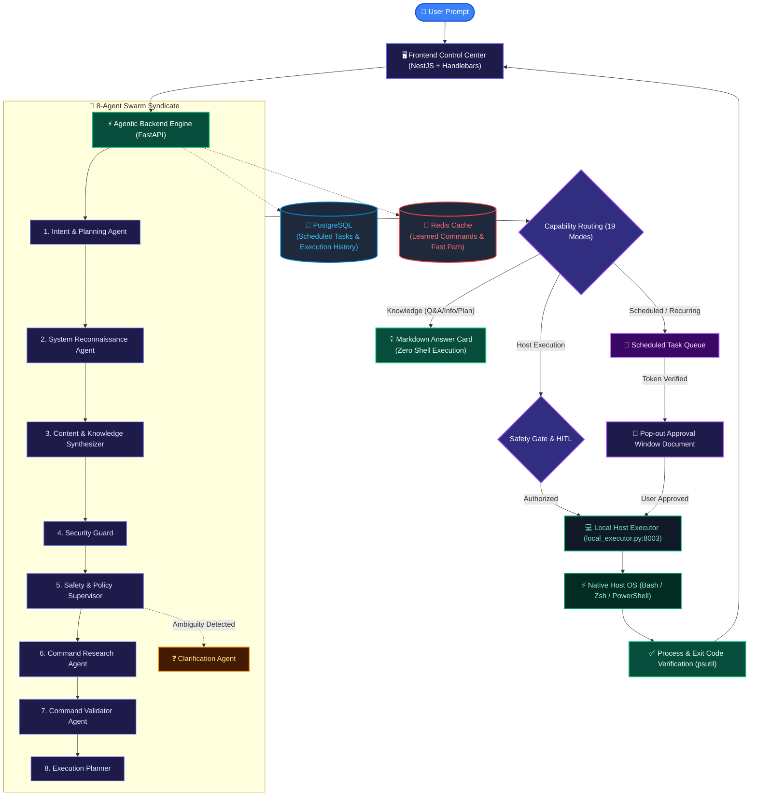

# 🐚 OmniShell - Universal Autonomous Multi-Agent OS & Knowledge Syndicate

## 🌟 Executive Summary

**OmniShell** is an enterprise-grade, multi-agent autonomous operating system copilot and knowledge syndicate designed to bridge the gap between Large Language Model (LLM) cognitive reasoning and physical host execution (Linux, macOS, Windows). 

Conventional AI chatbots (e.g., ChatGPT, Claude) are constrained to isolated conversational web boxes—they can describe *how* to execute a workflow, but they cannot perform it on your machine. Conversely, naive autonomous agent implementations often execute commands blindly without human verification, risking data corruption, system disruption, or unauthorized actions.

**OmniShell solves this by combining a decentralized 8-Agent Swarm Syndicate, a strict Request Control Plane (`Intent → Policy → Plan → Execute → Verify`), multi-layer Human-in-the-Loop (HITL) gates, and an isolated local host executor daemon.**

---

## 🏛️ System Topology & Decoupled Layers

OmniShell is architected with three cleanly decoupled operational layers:

### 1. The Presentation & Control Plane (NestJS + Handlebars + Tailwind CSS)
- **Real-time Lifecycle State Machine**: Displays the 5-stage lifecycle badges (`Intent → Policy → Plan → Execute → Verify`) with live color transitions (`COMPLETED`, `ACTIVE`, `PENDING`, `APPROVAL REQ`, `CLARIFICATION`).
- **Interactive Swarm Telemetry**: Live metric meters tracking LLM reasoning time, web research latency, security validation timing, and native execution duration.
- **Interactive Multi-Agent Syndicate Discussion**: Expandable transcript detailing the deliberation, AST checks, and execution planning of all 8 agents.
- **Dynamic Mermaid Flowchart Viewer**: Renders interactive Mermaid workflow diagrams with pan and `- Zoom`, `Reset`, `+ Zoom` canvas controls.
- **Dual Human-in-the-Loop Dialogues**:
  - *In-UI SweetAlert2 Modals*: For immediate elevated host operations with syntax-highlighted command previews.
  - *Pop-out Approval Window Documents (`/scheduled-approval/:token`)*: Standalone dedicated pages with SHA-256 token validation and 300-second countdown timers for background scheduled jobs.

### 2. The Cognitive Engine & Swarm Syndicate (FastAPI + LiteLLM + Redis + PostgreSQL)
- **8-Agent Swarm Collaboration**: Specialized agents decompose, screen, research, validate, and plan incoming prompts.
- **Clarification & Intent Disambiguation Engine**: Synthesizes structured, actionable choice options when prompts are ambiguous or missing parameters.
- **Knowledge Base & 3-Tier Command Caching**: Redis-backed fast-path for sub-millisecond execution of recognized operations without LLM overhead.
- **PostgreSQL Task & Execution Registry**: Persistent storage for background scheduled tasks, recurrence rules, approval tokens, and comprehensive execution logs.

### 3. The Native Host Execution Daemon (`local_executor.py` on Port 8003)
- **Isolated Host Bridge**: Runs natively in user-space on Windows, Linux, or macOS.
- **Safe Subprocess Pipeline**: Executes commands via `/bin/bash` or `powershell.exe` with real-time stdout/stderr capture, process group isolation, and timeout guards.
- **Process Verification**: Integrates `psutil` to inspect process trees, PID creation, and exit codes.
- **Cross-Platform Browser Launcher**: Detects installed browsers (Chrome, Brave, Firefox, Edge, Safari) and handles deep-link dispatches.
- **Background Scheduler Poller**: Periodically checks the backend queue, triggers pop-out approval documents when tasks mature, and executes approved jobs.

---

## 🎯 Primary Use Cases & Capabilities Summary

| Interaction Category | Description | Primary Execution Mechanism |
|---|---|---|
| **Direct Knowledge & Q&A** | Answers conceptual, factual, and technical queries | Rich Markdown Card (Zero Host Shell Invocation) |
| **System Diagnostics** | Inspects CPU, RAM, disk, network, and active processes | Native `psutil` & diagnostic terminal scripts |
| **Application & Browser Operations** | Launches applications and deep-links browser workflows | Native process dispatch & URL deep-linking |
| **Multi-Step Workflows** | Decomposes goals into sequential executable steps | Structured step tracker with progress states |
| **Scheduled & Recurring Tasks** | Runs tasks at future timestamps or recurring intervals | PostgreSQL scheduler queue + Pop-out Approval Window |
| **Self-Healing Recovery** | Recovers from command failures with retry heuristics | Automatic diagnostic analysis and fallback commands |

---

## 🔒 Enterprise Security & Guardrails

1. **Pre-LLM Regex Red-Line Interceptor**: Hardcoded deterministic filter blocking dangerous shell primitives (`rm -rf /`, `mkfs`, `dd if=/dev/zero`, password theft, credential dumping).
2. **AI Security Guard Agent**: Contextual AST analysis checking for privilege escalation, network exfiltration, or destructive file modifications.
3. **Double-Confirmation Human-in-the-Loop**: Destructive host operations require explicit confirmation before execution.
4. **Cryptographic Token Verification**: Scheduled tasks require single-use, URL-safe SHA-256 tokens to prevent replay or unauthorized execution.
