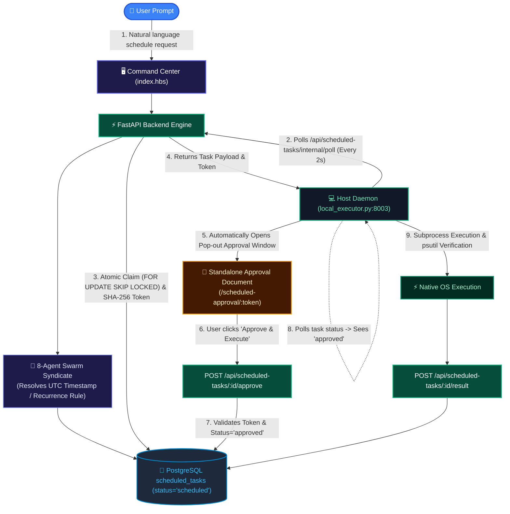

# ⏱️ Scheduled & Recurring Prompt Execution Specification

## 🌟 Feature Overview

OmniShell provides autonomous background scheduling and recurring workflow execution from plain natural language. A user can instruct the copilot to perform any system inspection, application launch, shell automation, or web action at an exact future time or recurring interval.

Unlike browser-dependent timers, OmniShell's scheduling system is **completely browser-independent**:
- The user can close the original browser tab or shut down the frontend interface entirely.
- The **Host Executor Daemon (`local_executor.py`)** runs persistently on the machine.
- When the task matures, the host daemon triggers a **Pop-out Approval Window Document** pointing to `/scheduled-approval/:token?taskId=:id`.
- The user approves the execution via the dedicated approval document before any code executes on the machine.

---

## 📝 Example Prompts

- **Relative Scheduling**: *"Open Spotify in the browser after 10 minutes"*
- **Exact Timestamp**: *"Run system diagnostics and backup logs tomorrow at 10:00 AM"*
- **Recurring Interval**: *"Check disk free space every 10 seconds and report"*
- **Daily Recurrence**: *"Clean /tmp folder every day at 09:00"*

---

## 🏗️ Architecture & Execution Lifecycle

---

## 🔒 Security & Token Verification Model

1. **Cryptographic One-Time Token Generation**:
   When a task is claimed for execution, the backend generates a 256-bit URL-safe token (`secrets.token_urlsafe(32)`) and stores its SHA-256 hash in PostgreSQL.
2. **Atomic Task Claiming**:
   The backend uses PostgreSQL row-level locks (`SELECT ... FOR UPDATE SKIP LOCKED`) to ensure multi-daemon setups never double-execute a single task.
3. **Dedicated Pop-out Approval Window (`scheduled-approval.hbs`)**:
   Provides an isolated review document displaying original intent, target OS, payload script preview, security badge, and a live 300-second countdown timer.
4. **Token Expiration Policy**:
   If the user does not authorize within 300 seconds, the token expires, transitioning the task status to `expired` and preventing unauthorized execution.

---

## 🔁 Recurrence Engine (`is_recurring=true`)

When recurring tasks complete execution on the host machine:
1. `store_scheduled_task_result` inspects the `recurrence_rule` (`interval:<N>s|m|h|d` or `daily:HH:MM`).
2. Calculates the next UTC timestamp.
3. Inserts or transitions the record back to `scheduled`, enabling zero-polling continuous automation.

---

## 🗄️ Database Model (`scheduled_tasks`)

| Column | Type | Description |
|---|---|---|
| `id` | `INTEGER` | Primary key |
| `original_prompt` | `TEXT` | Raw user instruction |
| `target_os` | `VARCHAR(32)` | Target operating system (`Linux`, `Windows`, `Darwin`) |
| `requires_browser` | `BOOLEAN` | Browser dispatch flag |
| `target_url` | `TEXT` | Resolved browser destination URL |
| `shell_script` | `TEXT` | Resolved executable shell command |
| `scheduled_for` | `TIMESTAMP` | UTC target execution timestamp |
| `status` | `VARCHAR(32)` | Lifecycle status (`scheduled`, `awaiting_approval`, `approved`, `completed`, `denied`, `expired`, `failed`, `cancelled`) |
| `approval_token` | `VARCHAR(128)` | Cryptographic one-time approval token |
| `is_recurring` | `BOOLEAN` | Recurring task flag |
| `recurrence_rule` | `VARCHAR(64)` | Interval or cron recurrence specification |

---

## 🌐 API Endpoints

- `GET /api/scheduled-tasks`: List all active and historic scheduled workflows.
- `GET /api/scheduled-tasks/{id}`: Retrieve detailed telemetry for a specific task.
- `POST /api/scheduled-tasks/{id}/cancel`: Cancel a pending scheduled task.
- `GET /api/scheduled-tasks/internal/poll`: Atomic claim endpoint for the Host Daemon.
- `POST /api/scheduled-tasks/{id}/approve`: Validates approval token and transitions task to `approved`.
- `POST /api/scheduled-tasks/{id}/deny`: Rejects execution and sets status to `denied`.
- `POST /api/scheduled-tasks/{id}/expire`: Transitions overdue unapproved tokens to `expired`.
- `POST /api/scheduled-tasks/{id}/result`: Records execution output, exit code, and triggers next recurrence.
