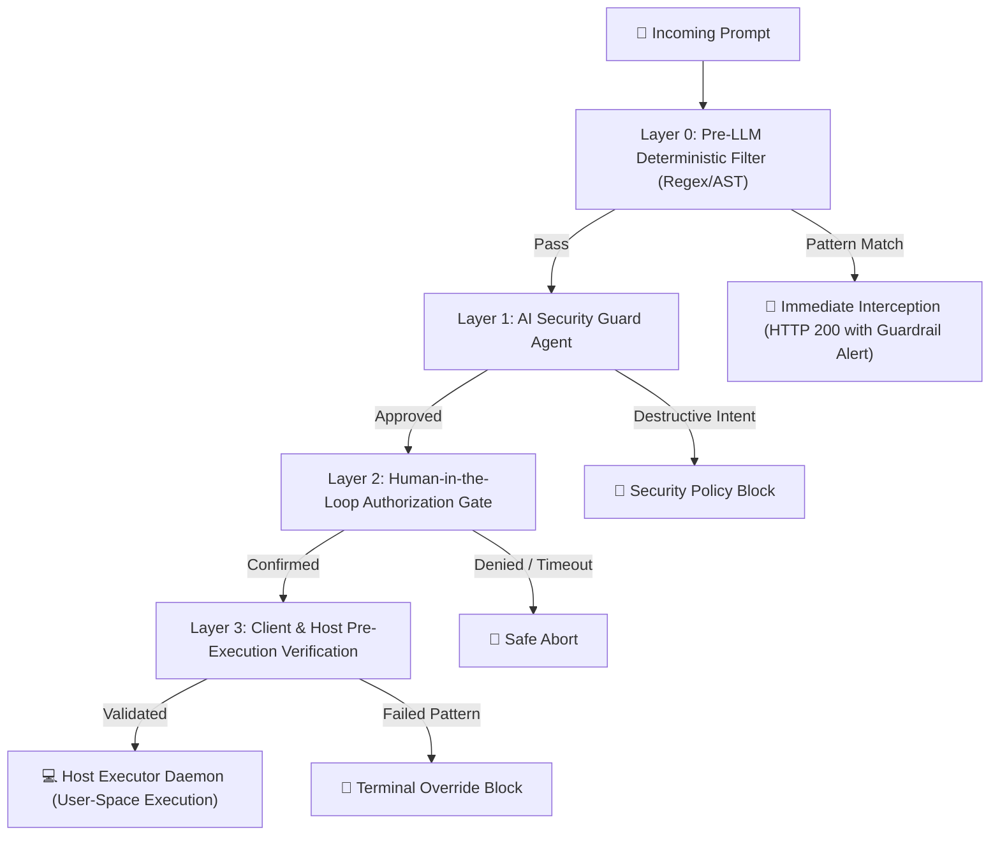

# 🛡️ OmniShell Security Architecture & Guardrails Specification

Security is the foundational design requirement of **OmniShell**. Operating system automation systems that accept natural language input face unique threats: prompt injection attacks, accidental destructive commands, privilege escalation, and unintended execution loops.

OmniShell eliminates these risks through a defense-in-depth security framework comprised of four distinct guardrail layers and strict Human-in-the-Loop policies.

---

## 🔒 The 4-Layer Defense Model

---

## 🧱 Layer 0: Pre-LLM Deterministic Red-Line Interceptor

Before any user prompt reaches the AI models or agent reasoning pipelines, it is scanned by a hardcoded, deterministic Python regular expression filter. 

> [!IMPORTANT]
> **Zero Jailbreak Vulnerability**: Because Layer 0 executes *before* any LLM tokenization, it is mathematically immune to prompt injection, semantic jailbreaks, roleplay bypasses, or adversarial suffix attacks.

### Blocked Pattern Categories:
1. **Root Filesystem Deletion**: `rm -rf /`, `rm -rf /*`, `rm -rf ~`, `rmdir /s /q C:\`
2. **Raw Disk Formatting**: `mkfs`, `fdisk`, `dd if=/dev/zero`, `format C:`
3. **Sensitive Credential Extraction**: `/etc/shadow`, `~/.ssh/id_rsa`, `SAM`, `SECURITY` registry hives
4. **Cryptocurrency Mining & Ransomware**: `xmrig`, `coinhive`, `minerd`
5. **Reverse Shells & Remote Sockets**: `nc -e`, `bash -i >& /dev/tcp/`, `meterpreter`

---

## 🤖 Layer 1: AI Security Guard Agent

The second layer is an active cognitive agent in the 8-Agent Swarm Syndicate that analyzes semantic intent:

- **Destructive Downgrade Enforcement**: If a user prompt requests sending an email or message autonomously without human review, the Security Guard automatically downgrades the intent from `send` to `draft`, constructing a browser deep-link instead of executing blind API calls.
- **Privilege Escalation Detection**: Evaluates whether commands attempt unauthorized `sudo`, `doas`, or `runas` escalation.
- **Data Exfiltration Screening**: Detects covert network uploads (`curl -d @/etc/passwd`).

---

## 👥 Layer 2: Human-in-the-Loop (HITL) Authorization

OmniShell enforces human oversight through two dedicated approval mechanisms:

### 1. In-UI SweetAlert2 Double-Confirmation (Immediate Tasks)
- Displays the exact syntax-highlighted command.
- Highlights target directories and affected files.
- Requires explicit click authorization before HTTP dispatches to port 8003.

### 2. Standalone Pop-out Approval Window (`/scheduled-approval/:token`)
- Used for scheduled workflows and background crons.
- Generates a **256-bit URL-safe token** (`secrets.token_urlsafe(32)`).
- Stores the **SHA-256 cryptographic hash** in PostgreSQL.
- Enforces an automated **300-second countdown timer**; tokens expire automatically if unapproved.

---

## 💻 Layer 3: Host Execution Sandboxing & Verification

When an approved payload reaches `local_executor.py` on port 8003:

1. **User-Space Isolation**: The daemon runs under the permissions of the current logged-in user—never as `root` or `SYSTEM`.
2. **Process Tree Tracking**: Uses `psutil` to track child PIDs and verify clean termination.
3. **Execution Timeout Guards**: Enforces a strict 30-second default execution timeout to prevent runaway scripts or infinite loops.
4. **Exit Code Assertions**: Verifies that `$? == 0` before reporting task success.
